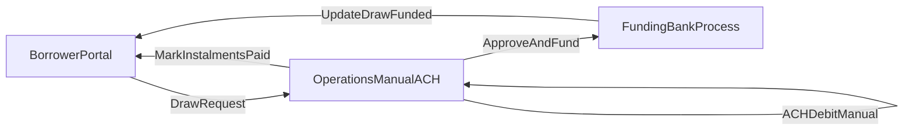

# Flexline — MVP Product Requirements Document (PRD)

**Status:** Draft for pilot MVP  
**Last updated:** 2026-04-14  
**UI note:** No bespoke visual design in MVP; use platform defaults unless layout is specified below because it affects requirements.

---

## 1. Problem

Pilot Flexline customers already have an approved line and are using it for working capital, but **draws and repayment coordination still flow through email and manual operations**. That creates avoidable friction, slower turnaround, weaker auditability, and a fragmented borrower experience.

The MVP should give pilots a **single portal** to **authenticate**, **request draws with transparent terms**, **maintain bank account details and verification state**, and **see repayment schedules and statuses**—while operations continues **manual ACH execution** from the existing bank process until payment-rail open questions are resolved.

---

## 2. Target users

| Persona                             | Needs                                                                                                                                                       |
| ----------------------------------- | ----------------------------------------------------------------------------------------------------------------------------------------------------------- |
| **Borrower portal user**            | Request draws, see available credit and schedules, add/verify bank accounts for disbursement (and future repayment setup), understand fees and instalments. |
| **Company contact / admin contact** | May receive portal access (via internal “enable login” flows); may act on behalf of the business depending on account setup.                                |
| **Operations**                      | See draw requests and repayment records, reconcile with manual ACH and funding processes, update statuses and limits as per internal policy.                |
| **Risk / underwriting**             | Move accounts through underwriting, record approve/reject decisions within defined limits, support audit trail of decisions.                                |

---

## 3. Scope

### 3.1 In scope (MVP)

- **Standalone Flexline authentication** for MVP (no requirement for shared US SCF portal login or portal picker in MVP).
- **Customer portal**
  - Sign-in / session management (details TBD with security team).
  - **Dashboard** showing at minimum **available credit** (and utilized where data exists).
  - **Draw request**: amount entry with validation against available credit; **3- or 6-month** term selection; **fees and repayment schedule preview** before confirmation; selection of a **verified disbursement bank account**; draw status visibility (**Processing / Funded / Declined** or equivalent).
  - **Bank accounts**: list accounts with verification status; add account with mandatory fields (account holder name, bank name, account type checking/savings, routing number, account number); **Plaid instant account verification (IAV) preferred**, **micro-deposit verification fallback**; clear status labels (e.g. pending verification vs verified).
  - **Repayments (non-payment execution)**: show **instalment schedule**, amounts, due dates, and **payment status** as recorded by operations; support borrower understanding of terms; store and display **instalment breakdown at draw level** where applicable.
- **Internal Flexline admin / operations surfaces** (implementation may map to existing internal apps—treat as product capabilities, not a tech stack mandate)
  - Flexline **company profile** type with lifecycle and utilization states (see §5).
  - Workflow: **Pending → Underwriting** (operator task), **Underwriting → Approved/Rejected** via **final decision** capture; paths involving **Accepted** as described in internal drafts.
  - **Importer-related visibility** aligned to internal process: Insurance, A-form Owners, Contacts, Documents, Sources (as tabs or equivalents).
  - Contacts: KYC form renamed for Flexline context; **“Enable Flexline Portal Login”** action with email behavior: password reset email if the contact has no prior Drip portal login; **welcome email** if they already have US SCF portal login explaining they can also access Flexline (draft copy to be finalized—**do not treat as legal fact** beyond “email sent”).
  - **Draws** and **Repayments** tabs/views for operations with identifiers (e.g. draw id) and key fields for reconciliation.
- **Success metric (from prior draft):** **100% of Flexline draws initiated through the portal** for pilot customers once live.

### 3.2 Explicitly out of scope for MVP

- **Webflow marketing site**, **NDAJ/LOS acquisition funnel**, and **new applicant onboarding** as part of this MVP delivery.
- **US SCF dual-portal login**, portal selection at login, and **cross-portal navigation without re-authentication**.
- **Customer-initiated repayment** in the portal (e.g. “pay now” rails), **Dwolla** or similar, and **automated ACH pull orchestration** from the portal—**operations continues manual ACH** from JPM processes until requirements are finalized.
- **Figma or custom visual system** for MVP UI (reference another product’s design language only if the team later adopts it; not required by this PRD).

### 3.3 Phased / TBD (capture in open questions)

- Full **ACH debit authorization** UX (mandatory disclosures, e-sign provider, retention) as specified in internal ACH drafts: **referenced as the target workflow** but **legal/compliance and timing vs MVP** must be confirmed before implementation commitments.
- **Consolidated business rules** for first instalment date offsets, facility anchor (1st vs 15th), and **grace vs overdue interest** (drafts conflict; see §9).

---

## 4. User stories and acceptance criteria

### 4.1 Authentication (standalone MVP)

- **As a** portal user **I want to** sign in with my business email **so that** I can access my Flexline facility securely.
  - **AC:** Successful login establishes a session; failed login shows a generic error (no account enumeration unless product/security approves otherwise).
  - **AC:** Password reset / invite flows exist for pilot onboarding (exact mechanism TBD).
  - **AC:** MVP does **not** require US SCF portal switching or shared credential behavior.

### 4.2 Dashboard

- **As a** borrower **I want to** see my **available credit** prominently **so that** I know how much I can draw.
  - **AC:** Available credit reflects draws and repayments recorded in the system (source of truth for numbers TBD with finance/ops).
  - **AC:** Clear entry points to **Bank accounts**, **Request draw**, and **Repayments/schedule** (labels flexible).

### 4.3 Bank accounts

- **As a** borrower **I want to** add a bank account **so that** I can receive disbursements.
  - **AC:** Mandatory fields: account holder name, bank name, account type (checking/savings), routing number, account number.
  - **AC:** User can list all accounts and see **verification status**.
  - **AC:** **Plaid IAV** offered as preferred path when available.
  - **AC:** **Micro-deposit fallback** when IAV is not possible; user is informed of delay (e.g. 1–2 business days); user can enter deposit amounts or verification code per chosen implementation; status updates on success/failure.
  - **AC:** Only **verified** accounts appear as selectable **disbursement** accounts on draw confirmation.

### 4.4 Draw request

- **As a** borrower **I want to** request a draw **so that** I receive working capital without emailing operations.
  - **AC:** Amount cannot exceed **available credit**; validation is immediate on entry/review step.
  - **AC:** User selects **3- or 6-month** term.
  - **AC:** Before confirmation, UI shows **fee breakdown** and **repayment schedule preview** for the selected amount and term, including the draft rule that **first instalment interest accrual period may differ** (from draw date to first instalment date) vs **subsequent monthly accrual**—exact formulas per §9 once finalized.
  - **AC:** User selects **verified** disbursement bank account.
  - **AC:** Confirmation creates a draw in **Processing** (or equivalent); user can see **Processing / Funded / Declined** with basic timestamps.

### 4.5 Repayments (visibility and terms; ops execution external)

- **As a** borrower **I want to** see my repayment schedule and what is due **so that** I can plan cash flow without asking operations for spreadsheets.
  - **AC:** Show instalments with **due date**, **amount**, **allocation** (principal/interest/fees at the level finance defines), and **status** (e.g. scheduled / paid / overdue) as determined by operations marking and business rules.
  - **AC:** Show **per-draw instalment breakdown** where multiple draws contribute to a monthly obligation.
  - **AC:** When an instalment is marked paid, **available credit** updates according to agreed limit logic (draft: facility limit frees by paid principal component—confirm in §9).

### 4.6 Flexline admin — company lifecycle

- **As** operations **I want to** create/track a Flexline company profile **so that** pilots are gated through underwriting and activation correctly.
  - **AC:** New Flexline company/user starts in **Pending** (per draft).
  - **AC:** Operator can run task **Move to underwriting** to transition **Pending → Underwriting**.
  - **AC:** Risk/operator can complete **final decision** to move **Underwriting → Approved** or **Rejected** subject to limits (exact authorization matrix TBD).
  - **AC:** Utilization flags **Active** vs **Suspended** exist and restrict portal actions as defined (define restrictions in §6 once decided).

### 4.7 Contacts — portal access enablement

- **As** operations **I want to** enable portal login for a contact **so that** the right person can access Flexline.
  - **AC:** Button/action **Enable Flexline Portal Login** exists per contact.
  - **AC:** If contact has **no** prior Drip portal login → send **password reset / setup** email (wording TBD).
  - **AC:** If contact **already** has US SCF portal login → send **welcome** email stating Flexline access with same credentials is available (copy subject to legal/comms review; **MVP does not depend on SCF SSO** per scope decision).

### 4.8 Operations views — Draws / Repayments

- **As** operations **I want** Draws and Repayments lists **so that** I can reconcile manual funding and ACH with portal activity.
  - **AC:** Draw list includes stable **draw identifier** and ties to company/facility, amount, term, status, timestamps, and disbursement account reference.
  - **AC:** Repayment list supports instalment lines and links to draws; supports **marking paid** (or integration to the system of record that does marking) per ops workflow.

### 4.9 ACH authorization package (draft-derived; not a compliance claim)

Internal drafts describe a post-verification **ACH debit authorization** step with **Nacha-oriented minimum content**, **checkbox + submit**, capture of **timestamp / IP / user agent**, **Adobe e-sign**, and document storage against the bank account.

- **AC (product intent, pending legal/ops timing):** PRD **tracks** this as the **documented target** for when repayment automation is in scope; **legal must approve** copy, method of consent, retention, and provider. **Do not interpret this PRD as certifying Nacha or E-Sign compliance.**

---

## 5. MVP-level data objects (conceptual)

Fields are indicative; schemas belong to engineering.

| Object                               | Purpose                             | Key fields / notes                                                                                                                                                                                                           |
| ------------------------------------ | ----------------------------------- | ---------------------------------------------------------------------------------------------------------------------------------------------------------------------------------------------------------------------------- |
| **Organization / Flexline facility** | Borrower entity for limit and draws | Identifiers, facility limit, utilized, available, lifecycle status (Pending/Underwriting/Approved/Accepted/Rejected per internal draft), utilization status (Active/Suspended), repayment anchor policy once defined (§9).   |
| **Portal user**                      | Login identity                      | Email, auth credentials reference, linkage to organization and role.                                                                                                                                                         |
| **Contact**                          | Person record from importer/KYC     | KYC payload reference; portal enabled flag; invitation timestamps.                                                                                                                                                           |
| **Bank account**                     | Disbursement (+ future repayment)   | Holder name, bank name, type, routing, account number (stored securely), mask for display, verification method (Plaid / micro-deposit), verification status, optional **authorization artifact** references (when in scope). |
| **Draw**                             | Single draw request / obligation    | Amount, term (3/6 mo), fee quote snapshot, schedule snapshot, disbursement bank account id, status, timestamps, decline reason (if applicable).                                                                              |
| **Instalment**                       | Scheduled repayment line            | Due date, amounts (principal/interest/fees), state, link to draw(s), aggregation key for monthly total.                                                                                                                      |
| **Repayment event / marking**        | Ops reconciliation                  | Amount, date, method (manual ACH, wire, etc.), allocations to instalments, operator id, notes.                                                                                                                               |
| **Admin decision**                   | Underwriting outcome                | Decision, limits, actor, timestamp, optional documents.                                                                                                                                                                      |
| **Imported tabs (references)**       | Risk/ops context                    | Insurance, A-form Owners, Contacts, Documents, Sources (Plaid/Equifax/D&B/AML/etc. as references in draft—not MVP to build scoring).                                                                                         |

---

## 6. Permissions (draft matrix)

| Capability                  | Borrower                      | Operations       | Risk / UW    | Admin read-only |
| --------------------------- | ----------------------------- | ---------------- | ------------ | --------------- |
| View own draws/schedule     | Yes                           | Yes (all pilots) | Yes (scoped) | TBD             |
| Create draw request         | If Active + Approved/Accepted | No               | No           | No              |
| Add/verify bank account     | Yes                           | TBD assist       | No           | No              |
| Move Pending → Underwriting | No                            | Yes              | Yes          | No              |
| Final approve/reject        | No                            | TBD              | Yes          | No              |
| Enable portal login         | No                            | Yes              | TBD          | No              |
| Mark repayment received     | No                            | Yes              | No           | No              |
| Suspend facility            | No                            | Yes              | Yes          | TBD             |

**TBD:** Split **operations** vs **finance** vs **risk** precisely; dual-control on high-risk actions (suggested in internal ACH notes, not mandated here).

---

## 7. Operational workflows (MVP-aligned)

1. **Draw — happy path:** Borrower submits draw → status **Processing** → operations validates limit, bank, and internal checks → funding executed per bank process → status **Funded** → schedule and fees visible on draw detail.
2. **Draw — decline:** Operations or policy declines → status **Declined** with internal reason code; borrower sees safe messaging.
3. **Bank verification:** Borrower completes Plaid or micro-deposit path → account **Verified** → eligible for draw disbursement selection.
4. **Repayment:** Operations runs **manual ACH** outside portal orchestration → operations records **paid** against instalment(s) → portal reflects paid and **credit availability** updates per agreed rules.
5. **Exceptions:** NSF, partial payments, holidays shifting ACH—**not defined in MVP PRD**; handled per ops SOP until codified (see §9).

---

## 8. Metrics

| Metric                                  | Type                              | Notes                                                                                  |
| --------------------------------------- | --------------------------------- | -------------------------------------------------------------------------------------- |
| **100% draws via portal**               | Launch success (from prior draft) | Measure weekly; exclude emergency ops-only draws only if explicitly allowed by policy. |
| **Time to first verified bank account** | Product health                    | Proposed.                                                                              |
| **Draw request → Funded median time**   | Ops efficiency                    | Proposed.                                                                              |
| **Bank verification completion rate**   | UX / ops load                     | Proposed.                                                                              |
| **Login success / reset completion**    | Access friction                   | Proposed.                                                                              |

---

## 9. Open questions

1. **Consolidated repayment calendar policy:** Finalize single set of rules for **facility anchor (1st vs 15th)**, **first instalment offset** after draw, **monthly aggregation** across draws, **grace period** before overdue interest, and **overdue interest** mechanics (drafts cite **3-day** grace in one place and **7-day** in others; pilot SOP uses **15th** anchor locked at onboarding).
2. **ACH debit authorization in MVP vs later:** With **manual ACH** now, does MVP still require full **e-sign + authorization** up front, or **verify-for-disbursement only** and defer mandate until automation?
3. **Funding rail vs status:** Should **Funded** reflect actual bank settlement, operations confirmation, or both?
4. **Partial payments and allocation order:** Not decided in drafts.
5. **Multi-user companies:** Multiple portal users per organization—roles and permissions.
6. **Future:** US SCF **shared login** and portal switching if product strategy changes.
7. **Notifications beyond stated emails:** Reminder strategy (before/after due date) not part of MVP commitment unless added.

---

## 10. Document precedence for this PRD

- **Authoritative for MVP shape:** Stakeholder decisions recorded in **§3** (pilots-only portal + admin, standalone login, **no** customer payment rails in MVP, ops manual ACH).
- **Authoritative for detailed journeys:** Primary Flexline MVP PDF and User Journey PDF where they do not conflict scope decisions; conflicts listed in §9.
- **Pilot SOP and spreadsheets:** Operational **as-is** context; not automatically product requirements.

---

## 11. Revision history

| Date       | Author  | Change                                                                 |
| ---------- | ------- | ---------------------------------------------------------------------- |
| 2026-04-14 | Product | Initial consolidated MVP PRD from internal drafts and pilot decisions. |

