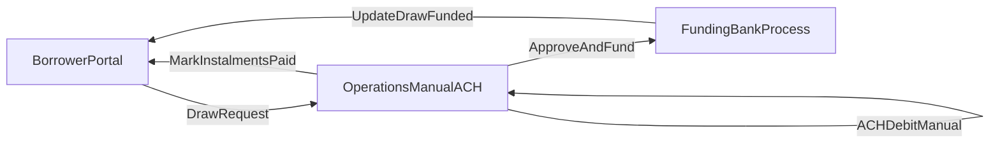

# Flexline — MVP Product Requirements Document (PRD)

**Status:** Draft for pilot MVP  
**Last updated:** 2026-04-16  
**UI note:** No bespoke visual design in MVP; use platform defaults unless layout is specified below because it affects requirements.

---

## 1. Problem

Pilot Flexline customers already have an approved line and are using it for working capital, but **draws and repayment coordination still flow through email and manual operations**. That creates avoidable friction, slower turnaround, weaker auditability, and a fragmented borrower experience.

The MVP should give pilots a **single portal** to **authenticate**, **request draws with transparent terms**, **maintain bank account details and verification state**, and **see repayment schedules and statuses**—while operations continues **manual ACH execution** from the existing bank process until payment-rail open questions are resolved.

---

## 2. Target users

| Persona                             | Needs                                                                                                                                                       |
| ----------------------------------- | ----------------------------------------------------------------------------------------------------------------------------------------------------------- |
| **Borrower portal user**            | Request draws, see available credit and schedules, add/verify bank accounts for disbursement (and future repayment setup), understand fees and instalments. |
| **Company contact / admin contact** | May receive portal access (via internal “enable login” flows); may act on behalf of the business depending on account setup.                                |
| **Operations**                      | See draw requests and repayment records, reconcile with manual ACH and funding processes, update statuses and limits as per internal policy; at volume, needs **queues, search, audit, and metrics** (see §3.4).                |
| **Risk / underwriting**             | Move accounts through underwriting, record approve/reject decisions within defined limits, support audit trail of decisions.                                |

---

## 3. Scope

### 3.1 In scope (MVP)

- **Standalone Flexline authentication** for MVP (no requirement for shared US SCF portal login or portal picker in MVP).
- **Customer portal**
  - Sign-in / session management (details TBD with security team).
  - **Dashboard** showing at minimum **available credit** (and utilized where data exists).
  - **Draw request**: amount entry with validation against available credit; **3- or 6-month** term selection; **fees and repayment schedule preview** before confirmation; selection of a **fully authorized** disbursement bank account (see §4.3.3); draw status visibility (**Processing / Funded / Declined** or equivalent).
  - **Bank accounts**: list accounts with clear **lifecycle status**; add account with mandatory fields (account holder name, bank name, account type checking/savings, routing number, account number); **Plaid IAV preferred**, **micro-deposit fallback**; **ACH authorization letter** completed via **Adobe eSign (Bluebird Third-Party API)** after ownership verification and **before** the account is treated as **fully authorized** for disbursement and future ACH debit (see §4.3.3 and §4.9).
  - **Repayments (non-payment execution)**: show **instalment schedule**, amounts, due dates, and **payment status** as recorded by operations; support borrower understanding of terms; store and display **instalment breakdown at draw level** where applicable.
- **Internal Flexline admin / operations surfaces** (implementation may map to existing internal apps—treat as product capabilities, not a tech stack mandate)
  - Flexline **company profile** type with lifecycle and utilization states (see §5).
  - Workflow: **Pending → Underwriting** (operator task), **Underwriting → Approved/Rejected** via **final decision** capture; paths involving **Accepted** as described in internal drafts.
  - **Importer-related visibility** aligned to internal process: Insurance, A-form Owners, Contacts, Documents, Sources (as tabs or equivalents).
  - Contacts: KYC form renamed for Flexline context; **“Enable Flexline Portal Login”** action with email behavior: password reset email if the contact has no prior Drip portal login; **welcome email** if they already have US SCF portal login explaining they can also access Flexline (draft copy to be finalized—**do not treat as legal fact** beyond “email sent”).
  - **Draws** and **Repayments** tabs/views for operations with identifiers (e.g. draw id) and key fields for reconciliation.
- **Success metric (from prior draft):** **100% of Flexline draws initiated through the portal** for pilot customers once live.

### 3.2 Explicitly out of scope for MVP

- **Webflow marketing site**, **NDAJ/LOS acquisition funnel**, and **new applicant onboarding** as part of this MVP delivery.
- **US SCF dual-portal login**, portal selection at login, and **cross-portal navigation without re-authentication**.
- **Customer-initiated repayment** in the portal (e.g. “pay now” rails), **Dwolla** or similar, and **automated ACH pull orchestration** from the portal—**operations continues manual ACH** from JPM processes until requirements are finalized.
- **Figma or custom visual system** for MVP UI (reference another product’s design language only if the team later adopts it; not required by this PRD).

### 3.3 Phased / TBD (capture in open questions)

- **ACH authorization letter:** Legal must supply the **final PDF** (with Adobe Sign text tags if required), disclosures, and signatory rules; engineering may ship with a **non-legal placeholder PDF** only for integration testing until final copy is approved (see `docs/templates/ach-authorization-letter-placeholder.md`).
- **Consolidated business rules** for first instalment date offsets, facility anchor (1st vs 15th), and **grace vs overdue interest** (drafts conflict; see §9).

### 3.4 Operator experience at scale (100+ customers)

Design assumption: a small ops team will **not** scale by opening each company in the borrower portal. Internal surfaces must support **throughput**, **audit**, and **prioritisation**.

**Work intake**

- **Queues (or equivalent saved views)** with counts: e.g. draws **Processing**, bank accounts **awaiting ownership verification**, **ACH/e-sign incomplete**, **failed verification**—each with **age** (time in state) and optional **SLA target** (policy-defined, e.g. business hours to first touch).
- **Global search** across at minimum **organization name**, **internal org id**, **draw id**, and **primary contact email** (exact scope TBD with privacy).
- **Filters and sort** on list screens: status, date range, amount band, facility lifecycle, portal suspended flag.
- **Assignment (optional policy):** ability to **claim** or **assign** a draw (or ticket) to an operator so two people do not duplicate work; **handoff** when out of office—exact rules TBD.

**Context on one screen**

- **Company snapshot** on draw/bank views: limit, **available / outstanding** (per agreed definitions), lifecycle, portal status, link to **all draws** and **all bank accounts** for that org.
- **Structured decline / hold reasons** (internal codes + borrower-safe messaging map) for reporting and fewer ad-hoc emails.
- **Links or references** to importer context (Contacts, Documents, etc.) as deep links or read-only summaries—implementation may stay in the importer app if Flexline admin only links out.

**Safety and compliance**

- **Immutable audit trail** for money-moving decisions: who approved/declined a draw, when, from which surface; bank status changes that affect payout eligibility; optional note field for ops.
- **Role separation** when policy requires it (ops vs risk vs read-only finance); **dual control** for high-risk overrides—**not mandated** in MVP unless security signs off (see §6).

**Reliability**

- **Visibility** when integrations fail (Plaid, facility sync, e-sign webhooks): surfaced status or ops runbook link; retry/dead-letter is an engineering concern but **operators need a non-silent failure mode**.

**Metrics (for staffing and process)**

- Queue depth by type, **median / p95 time** draw submitted → funded (or to decline), verification and e-sign funnel drop-off—captured in §8 where marked for ops scale.

### 3.5 Engineering deliverables — Flexline `rails_app` admin (pending product confirmation)

**Status:** Documented below for alignment. **Engineering must not start this build until product explicitly confirms** (reply or ticket). Scope is **Phase 1** in the existing **HTTP Basic** admin area unless replaced by shared internal auth later.

**Phase 1 (proposed build on confirmation)**

1. **`/admin` overview (dashboard)** — Counts of draws by status (at least **Processing**), optional counts for bank accounts in **awaiting_plaid**, **micro_deposit_sent**, **failed**; each count links to a **pre-filtered** list view.
2. **`/admin/draws` index upgrades** — **Search** (organization name, draw id); **filters** (status, created date range); **sort** (newest first, oldest first, amount); columns including **organization**, **amount**, **term**, **age in queue**, **disbursement account mask**, **created_at**; **CSV export** of the current filtered result set.
3. **`/admin/draws/:id` upgrades** — **Internal operator notes** (persisted on the draw); decline path uses **structured internal reason** (enum or taxonomy) plus existing borrower-facing messaging rules; show **company snapshot** (limit, available, outstanding, portal status, lifecycle).
4. **`/admin/organizations` index + show** — Paginated list with **search** by name; **show** page lists recent draws and bank account summary (status, method, mask)—navigation hub for “everything about this customer.”
5. **`/admin/bank_accounts` index** — Cross-organization list with **filters** (verification status, verification method, org search); columns for org, mask, method, statuses, timestamps; link to borrower-facing bank detail or admin show as implemented.
6. **`AdminEvent` (or equivalent) audit model** — Append-only rows for **draw approved**, **draw declined**, and other admin actions with **timestamp**, **action type**, **subject** (draw/org/bank), **actor identifier** (e.g. HTTP Basic username in MVP), optional JSON **metadata**; **show recent events** on draw/org admin pages.

**Explicitly not in Phase 1** (remain PRD / later phases unless re-scoped on confirmation)

- Full **RBAC** beyond Basic-auth operator identity, **dual approval** workflows, **email template CMS**, **Slack/PagerDuty** integrations, **borrower in-app messaging**, and **automatic SLA breach alerts**.

---

## 4. User stories and acceptance criteria

### 4.1 Authentication (standalone MVP)

- **As a** portal user **I want to** sign in with my business email **so that** I can access my Flexline facility securely.
  - **AC:** Successful login establishes a session; failed login shows a generic error (no account enumeration unless product/security approves otherwise).
  - **AC:** Password reset / invite flows exist for pilot onboarding (exact mechanism TBD).
  - **AC:** MVP does **not** require US SCF portal switching or shared credential behavior.

### 4.2 Dashboard

- **As a** borrower **I want to** see my **available credit** prominently **so that** I know how much I can draw.
  - **AC:** Available credit reflects draws and repayments recorded in the system (source of truth for numbers TBD with finance/ops).
  - **AC:** Clear entry points to **Bank accounts**, **Request draw**, and **Repayments/schedule** (labels flexible).

### 4.3 Bank accounts

- **As a** borrower **I want to** add a bank account **so that** I can receive disbursements.
  - **AC:** Mandatory fields: account holder name, bank name, account type (checking/savings), routing number, account number.
  - **AC:** User can list all accounts and see **ownership verification status** (Plaid / micro-deposit) and **ACH authorization / e-sign status** as distinct dimensions (labels TBD with legal; e.g. “Ownership verified” vs “ACH authorization complete”).
  - **AC:** **Plaid IAV** offered as preferred path when available.
  - **AC:** **Micro-deposit fallback** when IAV is not possible; user is informed of delay (e.g. 1–2 business days); user can enter deposit amounts or verification code per chosen implementation; status updates on success/failure.
  - **AC:** **Ownership verification** (Plaid success **or** micro-deposit success) is **required** before the **ACH authorization letter** can be sent for signature (see §4.3.3).
  - **AC:** Only bank accounts that are **fully authorized** (ownership verified **and** ACH letter **signed** per §4.9) appear as selectable **disbursement** accounts on draw confirmation.
  - **AC:** If ownership is verified but ACH is unsigned, the portal shows a **clear next step** (open signing URL, resend, or contact support) without implying the account is ready for draws.

#### 4.3.1 Bank verification — borrower edge cases (UX + rules)

The portal design explicitly covers: **duplicate routing+account** (blocked with a single clear error); **legal name mismatch vs bank records** (captured at onboarding, re-checked by ops before payout); **Plaid unavailable / institution not listed** (in-place **switch to micro-deposits** without re-keying account numbers); **abandoned Plaid** (account remains **Awaiting Plaid** until completion, switch, or restart); **micro-deposit timing** (1–2 business day expectation, correct account type); **micro-deposit expiry** (configurable window, e.g. 10 days—restart required); **wrong micro amounts** (limited attempts, then **Failed** with restart); **verified account needs new numbers** (no in-place edit of core rails—**add + verify** a new account); **draw gating** (only **fully authorized** accounts selectable—see §4.3.3); **non-US / non-ACH** (copy + validation scope; Plaid errors funnel to micro where applicable).

#### 4.3.3 ACH authorization letter and e-sign (gate after ownership verification)

**Sequence (non-negotiable for product intent):** (1) Borrower completes **ownership verification** via **Plaid IAV** or **micro-deposit** confirmation. (2) Portal **then** presents (or automatically initiates) the **ACH authorization letter** for **electronic signature**. (3) Only after the agreement is **signed** (per callback / status from the e-sign provider) is the bank account treated as **fully authorized** for **draw disbursement selection** and for **future ACH debit** once automation exists. **Manual ACH in MVP** does not remove the requirement to **capture and store** the signed authorization for the verified account when this flow is live.

**Document:** Legal supplies the production **PDF** (with Adobe Sign **text tags** for signers if required by the integration). Until then, engineering may use a **placeholder PDF** for integration testing only—see `docs/templates/ach-authorization-letter-placeholder.md`.

**Integration:** **Adobe Acrobat Sign** via the internal **Bluebird Third-Party API** (`adobe_esign_upload`, signing URLs, and webhook/callback with the **signed PDF**). **API reference:** [Adobe eSign API (GitBook)](https://dripcapital-1.gitbook.io/third-party-api-docs/5iVFAdCGrNAmNvJUnBTJ/adobe-esign-api).

**Borrower UX:** After step (1), show **“Sign ACH authorization”** (or equivalent); deep-link or embed flow per Adobe/signing URL pattern from the API; on **decline / expire / void**, show recovery (restart agreement, contact ops—exact rules TBD with legal).

**Admin / ops:** Bank account list shows **e-sign status** (sent, viewed, signed, declined, expired), **agreement / envelope id** (or internal correlation id), **timestamps**, and link or storage reference to the **signed PDF** artifact for audit.

#### 4.3.2 Admin / operations — bank account and verification

Importer **company** and **facility limit** remain the source of truth for **approved credit**; the portal reads **available / limit** from the integrated service (sync mechanism TBD). **Contacts** use **Enable Flexline Portal Login** so the right email can access the borrower portal.

For bank accounts, admin/ops needs at minimum: **list** of accounts per organization with **ownership verification status**, **verification method** (Plaid vs micro-deposit), **ACH / e-sign status** and **agreement id** (or envelope id), **mask**, **primary disbursement flag**, **timestamps** (created, ownership verified, ACH sent, ACH signed, failed), **failure reason** (if any), **Plaid item/account identifiers** for support, and **signed PDF** storage reference when available. **Draw** views must show **which fully authorized bank account** was selected for disbursement. Operators run **transaction risk policy** before funding; **no payout** to an account unless portal (and admin) show **fully authorized** (ownership + signed ACH letter). When funding completes, **draw status** updates in admin and portal; **email** notifications should fire on verification success/failure, **ACH sent/signed/declined**, draw processing/funded/declined, and micro-deposit lifecycle as agreed with comms.

Future automation: **risk policy on draw submit** and **ACH/wire initiation** after pass—admin fields should support audit of **automation vs manual** decisions without redesigning the borrower flow.

### 4.4 Draw request

- **As a** borrower **I want to** request a draw **so that** I receive working capital without emailing operations.
  - **AC:** Amount cannot exceed **available credit**; validation is immediate on entry/review step.
  - **AC:** User selects **3- or 6-month** term.
  - **AC:** Before confirmation, UI shows **fee breakdown** and **repayment schedule preview** for the selected amount and term, including the draft rule that **first instalment interest accrual period may differ** (from draw date to first instalment date) vs **subsequent monthly accrual**—exact formulas per §9 once finalized.
  - **AC:** User selects a **fully authorized** disbursement bank account (ownership verified and ACH letter signed per §4.3.3).
  - **AC:** Confirmation creates a draw in **Processing** (or equivalent); user can see **Processing / Funded / Declined** with basic timestamps.

### 4.5 Repayments (visibility and terms; ops execution external)

- **As a** borrower **I want to** see my repayment schedule and what is due **so that** I can plan cash flow without asking operations for spreadsheets.
  - **AC:** Show instalments with **due date**, **amount**, **allocation** (principal/interest/fees at the level finance defines), and **status** (e.g. scheduled / paid / overdue) as determined by operations marking and business rules.
  - **AC:** Show **per-draw instalment breakdown** where multiple draws contribute to a monthly obligation.
  - **AC:** When an instalment is marked paid, **available credit** updates according to agreed limit logic (draft: facility limit frees by paid principal component—confirm in §9).

### 4.6 Flexline admin — company lifecycle

- **As** operations **I want to** create/track a Flexline company profile **so that** pilots are gated through underwriting and activation correctly.
  - **AC:** New Flexline company/user starts in **Pending** (per draft).
  - **AC:** Operator can run task **Move to underwriting** to transition **Pending → Underwriting**.
  - **AC:** Risk/operator can complete **final decision** to move **Underwriting → Approved** or **Rejected** subject to limits (exact authorization matrix TBD).
  - **AC:** Utilization flags **Active** vs **Suspended** exist and restrict portal actions as defined (define restrictions in §6 once decided).

### 4.7 Contacts — portal access enablement

- **As** operations **I want to** enable portal login for a contact **so that** the right person can access Flexline.
  - **AC:** Button/action **Enable Flexline Portal Login** exists per contact.
  - **AC:** If contact has **no** prior Drip portal login → send **password reset / setup** email (wording TBD).
  - **AC:** If contact **already** has US SCF portal login → send **welcome** email stating Flexline access with same credentials is available (copy subject to legal/comms review; **MVP does not depend on SCF SSO** per scope decision).

### 4.8 Operations views — Draws / Repayments

- **As** operations **I want** Draws and Repayments lists **so that** I can reconcile manual funding and ACH with portal activity.
  - **AC:** Draw list includes stable **draw identifier** and ties to company/facility, amount, term, status, timestamps, and disbursement account reference.
  - **AC:** Repayment list supports instalment lines and links to draws; supports **marking paid** (or integration to the system of record that does marking) per ops workflow.
  - **AC (scale, §3.4):** Once §3.5 Phase 1 is confirmed and built, admin draw flows support **search, filter, sort, queue entry from `/admin` overview, CSV export, internal notes, structured decline codes, and AdminEvent audit** as specified there.

### 4.9 ACH authorization and Adobe eSign (MVP product intent; not a compliance claim)

**Purpose:** Capture a **borrower-signed ACH authorization letter** for the **specific verified bank account**, stored for operations and future ACH automation. **Legal/compliance** owns final copy, signer rules, disclosures, and retention; **this PRD does not certify Nacha, E-Sign, or state UCC compliance.**

**When it runs:** **Immediately after** successful **ownership verification** (Plaid **or** micro-deposit)—see §4.3.3. It is **not** complete before that step.

**How it runs (integration):** Flexline (or shared platform service) calls the **Bluebird Third-Party API** for **Adobe Acrobat Sign**: upload agreement (`adobe_esign_upload`), obtain **signing URLs** for the borrower (and any additional signers if legal requires), and consume **webhook/callback** payload to mark **signed** and persist the **returned signed PDF** against the bank account record. **Authoritative API shapes and field names:** [Adobe eSign API (GitBook)](https://dripcapital-1.gitbook.io/third-party-api-docs/5iVFAdCGrNAmNvJUnBTJ/adobe-esign-api).

**Data to retain (minimum product intent):** Correlation ids (**envelope / agreement id** as returned by the integration), **status timeline** (created, sent, signed, declined, expired), **signer identity** as provided by the integration, **signed PDF** blob or secure object reference, and **linkage** to organization + bank account + portal user who initiated.

**AC:** ACH flow cannot mark an account **fully authorized** until **ownership verification** has succeeded **and** the integration reports **signed** with stored artifact.

**AC:** Borrower can complete signing from the **signing URL** without operations intervention in the happy path.

**AC:** Admin can see **e-sign status** and retrieve or link to the **signed PDF** for support and audit.

**AC:** Expired/voided/declined agreements block draw selection until a **new** agreement is completed (policy detail with legal).

---

## 5. MVP-level data objects (conceptual)

Fields are indicative; schemas belong to engineering.

| Object                               | Purpose                             | Key fields / notes                                                                                                                                                                                                           |
| ------------------------------------ | ----------------------------------- | ---------------------------------------------------------------------------------------------------------------------------------------------------------------------------------------------------------------------------- |
| **Organization / Flexline facility** | Borrower entity for limit and draws | Identifiers, facility limit, utilized, available, lifecycle status (Pending/Underwriting/Approved/Accepted/Rejected per internal draft), utilization status (Active/Suspended), repayment anchor policy once defined (§9).   |
| **Portal user**                      | Login identity                      | Email, auth credentials reference, linkage to organization and role.                                                                                                                                                         |
| **Contact**                          | Person record from importer/KYC     | KYC payload reference; portal enabled flag; invitation timestamps.                                                                                                                                                           |
| **Bank account**                     | Disbursement (+ future repayment)   | Holder name, bank name, type, routing, account number (stored securely), mask for display, **ownership verification** method (Plaid / micro-deposit) and status, **ACH authorization** status, **Adobe/agreement id**, **signed PDF** reference, timestamps for verification and e-sign milestones. |
| **Draw**                             | Single draw request / obligation    | Amount, term (3/6 mo), fee quote snapshot, schedule snapshot, disbursement bank account id, status, timestamps, decline reason (if applicable); **internal operator notes** (§3.5); optional **internal decline code** (§3.4).                                                                              |
| **AdminEvent** (or equivalent)       | Ops / audit                         | Action type, subject references, actor identifier, timestamp, metadata JSON (§3.5 Phase 1).                                                                                                                                 |
| **Instalment**                       | Scheduled repayment line            | Due date, amounts (principal/interest/fees), state, link to draw(s), aggregation key for monthly total.                                                                                                                      |
| **Repayment event / marking**        | Ops reconciliation                  | Amount, date, method (manual ACH, wire, etc.), allocations to instalments, operator id, notes.                                                                                                                               |
| **Admin decision**                   | Underwriting outcome                | Decision, limits, actor, timestamp, optional documents.                                                                                                                                                                      |
| **Imported tabs (references)**       | Risk/ops context                    | Insurance, A-form Owners, Contacts, Documents, Sources (Plaid/Equifax/D&B/AML/etc. as references in draft—not MVP to build scoring).                                                                                         |

---

## 6. Permissions (draft matrix)

| Capability                  | Borrower                      | Operations       | Risk / UW    | Admin read-only |
| --------------------------- | ----------------------------- | ---------------- | ------------ | --------------- |
| View own draws/schedule     | Yes                           | Yes (all pilots) | Yes (scoped) | TBD             |
| Create draw request         | If Active + Approved/Accepted | No               | No           | No              |
| Add/verify bank account     | Yes                           | TBD assist       | No           | No              |
| Move Pending → Underwriting | No                            | Yes              | Yes          | No              |
| Final approve/reject        | No                            | TBD              | Yes          | No              |
| Enable portal login         | No                            | Yes              | TBD          | No              |
| Mark repayment received     | No                            | Yes              | No           | No              |
| Suspend facility            | No                            | Yes              | Yes          | TBD             |

**TBD:** Split **operations** vs **finance** vs **risk** precisely; dual-control on high-risk actions (suggested in internal ACH notes, not mandated here).

---

## 7. Operational workflows (MVP-aligned)

1. **Draw — happy path:** Borrower submits draw → status **Processing** → operations validates limit, bank, and internal checks → funding executed per bank process → status **Funded** → schedule and fees visible on draw detail.
2. **Draw — decline:** Operations or policy declines → status **Declined** with internal reason code; borrower sees safe messaging.
3. **Bank account authorization:** Borrower completes **Plaid or micro-deposit** (ownership verified) → portal initiates **ACH authorization letter** via **Adobe eSign (Bluebird API)** → borrower signs → account **fully authorized** → eligible for draw disbursement selection.
4. **Repayment:** Operations runs **manual ACH** outside portal orchestration → operations records **paid** against instalment(s) → portal reflects paid and **credit availability** updates per agreed rules.
5. **Exceptions:** NSF, partial payments, holidays shifting ACH—**not defined in MVP PRD**; handled per ops SOP until codified (see §9).

---

## 8. Metrics

| Metric                                  | Type                              | Notes                                                                                  |
| --------------------------------------- | --------------------------------- | -------------------------------------------------------------------------------------- |
| **100% draws via portal**               | Launch success (from prior draft) | Measure weekly; exclude emergency ops-only draws only if explicitly allowed by policy. |
| **Time to first fully authorized bank account** | Product health            | From add account through ownership verification + ACH signed.                          |
| **Draw request → Funded median time**   | Ops efficiency                    | Proposed.                                                                              |
| **Bank verification completion rate**   | UX / ops load                     | Proposed.                                                                              |
| **ACH authorization signed rate**       | Compliance / funnel health        | % of ownership-verified accounts that reach **signed** within N days; drop-off at e-sign. |
| **Login success / reset completion**    | Access friction                   | Proposed.                                                                              |
| **Draw queue depth (Processing)**       | Ops scale                         | Count over time; target thresholds for staffing (§3.4).                                |
| **Draw age in queue (p50 / p95 hours)** | Ops scale                         | Time from borrower submit to Funded or Declined; segment by amount band if useful.      |
| **Admin audit coverage**                | Compliance                        | % of approve/decline actions with a corresponding **AdminEvent** row once §3.5 Phase 1 ships. |

---

## 9. Open questions

1. **Consolidated repayment calendar policy:** Finalize single set of rules for **facility anchor (1st vs 15th)**, **first instalment offset** after draw, **monthly aggregation** across draws, **grace period** before overdue interest, and **overdue interest** mechanics (drafts cite **3-day** grace in one place and **7-day** in others; pilot SOP uses **15th** anchor locked at onboarding).
2. **ACH letter content and signers:** Final **legal PDF**, required **signatories** (single borrower admin vs dual), **regeneration** when bank details change after signing, and **Adobe text-tag** placement—owned by legal with engineering for upload template.
3. **Funding rail vs status:** Should **Funded** reflect actual bank settlement, operations confirmation, or both?
4. **Partial payments and allocation order:** Not decided in drafts.
5. **Multi-user companies:** Multiple portal users per organization—roles and permissions.
6. **Future:** US SCF **shared login** and portal switching if product strategy changes.
7. **Notifications beyond stated emails:** Reminder strategy (before/after due date) not part of MVP commitment unless added.

---

## 10. Document precedence for this PRD

- **Authoritative for MVP shape:** Stakeholder decisions recorded in **§3** (pilots-only portal + admin, standalone login, **no** customer payment rails in MVP, ops manual ACH).
- **Authoritative for detailed journeys:** Primary Flexline MVP PDF and User Journey PDF where they do not conflict scope decisions; conflicts listed in §9.
- **Pilot SOP and spreadsheets:** Operational **as-is** context; not automatically product requirements.

---

## 11. Revision history

| Date       | Author  | Change                                                                 |
| ---------- | ------- | ---------------------------------------------------------------------- |
| 2026-04-14 | Product | Initial consolidated MVP PRD from internal drafts and pilot decisions. |
| 2026-04-14 | Product | Added §4.3.1 borrower bank-verification edge cases and §4.3.2 admin/ops bank + notification requirements. |
| 2026-04-15 | Product | ACH authorization letter + **Adobe eSign (Bluebird TPA)** after Plaid/micro-deposit; §4.3.3, §4.9, data object and workflow updates; placeholder template under `docs/templates/`. |
| 2026-04-16 | Product | §3.4 operator-at-scale requirements; §3.5 **pending-confirmation** engineering deliverables for Rails admin; §5 AdminEvent + draw notes; §8 ops metrics; Operations persona pointer. |

